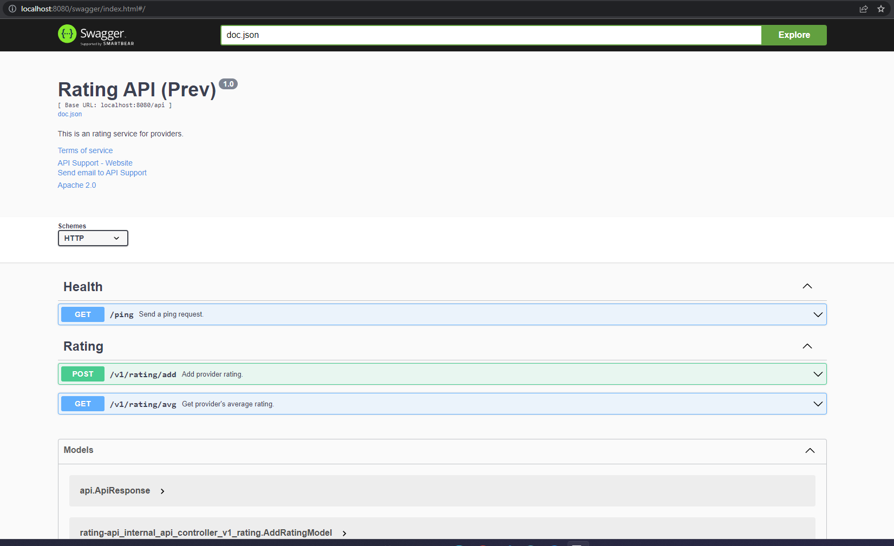

## Introduction
This repo contains a some CRUD RESTful API running on the Gin Gonic HTTP server and using a PostgreSQL database.

*Api Endpoints:*

`BaseURL: localhost:8080/api`
```bash
POST ​/v1​/rating​/add #Add provider rating.
#AddRatingRequestModel
{
  "ProviderId": "string",
  "Rate": 0,
  "ServiceId": "string",
  "UserName": "string"
}
```
```bash
GET  ​/v1​/rating​/avg?providerId= #Get provider's average rating.
```
## Getting Started
The database will be created with docker-compose. The tables will be created automatically after the services are up.  
In order to run this container you'll need docker installed.
* [Windows](https://docs.docker.com/windows/started)
* [OS X](https://docs.docker.com/mac/started/)
* [Linux](https://docs.docker.com/linux/started/)

Clone the repository.
```bash
git clone https://github.com/emrebilal/go-web-api-with-gin.git
```
Go to the main folder directory of the repo and run it.
```bash
docker-compose build
docker-compose up
```
### Swagger

